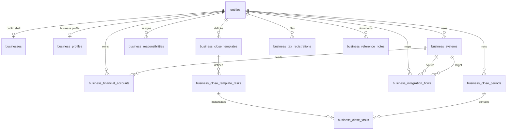

# Business Schema Proposal

## Goal

Add a `business` schema that supports bookkeeping operations for privately managed companies without turning the app into a general ledger.

The design principle is:

- `public.entities` remains the canonical identity layer.
- `public.businesses` remains the thin public/business-shell profile.
- `business.*` holds operational bookkeeping context, responsibilities, systems, workflows, and recurring close execution.

This keeps the current architecture consistent with `branding`, `governance`, and `irs`.

## Why This Schema Exists

The bookkeeping problem here is not "store all accounting transactions."

It is:

- which business uses which systems
- which financial accounts exist
- who owns each responsibility
- how money and data move across systems
- what must happen every month
- where exceptions, dependencies, and SOP notes live

That makes this schema an operational memory layer around QuickBooks, banks, payroll, POS, ERP, merchant processing, and tax filing.

## What Stays In `public`

These tables should remain the shared cross-domain primitives:

- `public.entities`
- `public.businesses`
- `public.entity_users`
- `public.entity_person_roles`
- `public.entity_user_invites`
- `public.entity_contacts`

Reason:

- they are reusable across districts, nonprofits, and businesses
- they already drive routing, RLS, and entity identity
- business-specific tables should reference `entity_id`, not replace entity primitives

## Proposed Schema Boundary

Use a dedicated Postgres schema:

```sql
create schema if not exists business;
```

Use it for:

- bookkeeping operations metadata
- recurring close workflow state
- external-system registry
- tax and filing cadence
- account ownership and reconciliation responsibilities
- operating notes and integration flow maps

Do not use it yet for:

- double-entry accounting
- invoice/AP/AR ledgers
- bank-feed replication
- payroll transaction storage
- inventory valuation engines

## Core Model



## Tables

### `business.business_profiles`

One row per business entity. This is the operational extension of `public.businesses`.

Suggested columns:

- `entity_id uuid primary key references public.entities(id) on delete cascade`
- `legal_name text not null`
- `dba_name text null`
- `ein text null`
- `state_of_formation text null`
- `entity_structure text null`
- `fiscal_year_end_month int null`
- `fiscal_year_end_day int null`
- `bookkeeping_status text not null default 'active'`
- `close_cadence text not null default 'monthly'`
- `default_accounting_basis text null`
- `notes text null`
- `created_at timestamptz not null default now()`
- `updated_at timestamptz not null default now()`

Purpose:

- legal and bookkeeping identity
- not public marketing metadata
- not system/account inventory

### `business.business_systems`

Registry of systems used by each business.

Suggested columns:

- `id uuid primary key default gen_random_uuid()`
- `entity_id uuid not null references public.entities(id) on delete cascade`
- `system_type text not null`
- `system_name text not null`
- `vendor_name text null`
- `external_org_id text null`
- `environment text null`
- `is_primary boolean not null default false`
- `status text not null default 'active'`
- `owner_person_role_id uuid null references public.entity_person_roles(id) on delete set null`
- `owner_user_id uuid null references public.profiles(id) on delete set null`
- `access_notes text null`
- `created_at timestamptz not null default now()`
- `updated_at timestamptz not null default now()`

Recommended `system_type` values:

- `accounting`
- `bank`
- `credit_card`
- `payroll`
- `merchant_processor`
- `sales_tax`
- `erp`
- `inventory`
- `pos`
- `document_storage`

Examples:

- QuickBooks Online company
- Wells Fargo online banking
- Amex business card portal
- Gusto or ADP
- Shopify Payments or Stripe
- Epicor

### `business.business_financial_accounts`

Inventory of the actual accounts that need operational oversight.

Suggested columns:

- `id uuid primary key default gen_random_uuid()`
- `entity_id uuid not null references public.entities(id) on delete cascade`
- `system_id uuid null references business.business_systems(id) on delete set null`
- `account_type text not null`
- `account_name text not null`
- `institution_name text null`
- `external_account_ref text null`
- `masked_account_number text null`
- `currency_code text not null default 'USD'`
- `is_active boolean not null default true`
- `is_reconcilable boolean not null default true`
- `reconciliation_cadence text not null default 'monthly'`
- `notes text null`
- `created_at timestamptz not null default now()`
- `updated_at timestamptz not null default now()`

Recommended `account_type` values:

- `checking`
- `savings`
- `credit_card`
- `loan`
- `line_of_credit`
- `merchant_settlement`
- `petty_cash`
- `clearing`

This is where "Which banks?" and "Credit cards?" become structured data.

### `business.business_responsibilities`

Who does what for each business.

Suggested columns:

- `id uuid primary key default gen_random_uuid()`
- `entity_id uuid not null references public.entities(id) on delete cascade`
- `responsibility_type text not null`
- `person_role_id uuid null references public.entity_person_roles(id) on delete set null`
- `user_id uuid null references public.profiles(id) on delete set null`
- `contact_name text null`
- `contact_email text null`
- `contact_phone text null`
- `system_id uuid null references business.business_systems(id) on delete set null`
- `account_id uuid null references business.business_financial_accounts(id) on delete set null`
- `is_primary boolean not null default true`
- `starts_on date null`
- `ends_on date null`
- `notes text null`
- `created_at timestamptz not null default now()`
- `updated_at timestamptz not null default now()`

Recommended `responsibility_type` values:

- `owner`
- `bookkeeper`
- `reconciler`
- `depositor`
- `payroll_processor`
- `sales_tax_filer`
- `cpa`
- `approver`
- `bank_admin`
- `qb_admin`

This is the answer to:

- who owns it
- who reconciles
- who makes deposits
- who handles payroll
- who is the CPA

### `business.business_close_templates`

Reusable month-end checklist definitions per business.

Suggested columns:

- `id uuid primary key default gen_random_uuid()`
- `entity_id uuid not null references public.entities(id) on delete cascade`
- `name text not null`
- `description text null`
- `close_frequency text not null default 'monthly'`
- `is_active boolean not null default true`
- `created_by uuid null references public.profiles(id) on delete set null`
- `created_at timestamptz not null default now()`
- `updated_at timestamptz not null default now()`

### `business.business_close_template_tasks`

Task definitions inside a reusable close template.

Suggested columns:

- `id uuid primary key default gen_random_uuid()`
- `template_id uuid not null references business.business_close_templates(id) on delete cascade`
- `task_key text not null`
- `title text not null`
- `description text null`
- `task_type text not null`
- `sort_order int not null default 100`
- `default_due_day int null`
- `responsibility_type text null`
- `system_id uuid null references business.business_systems(id) on delete set null`
- `account_id uuid null references business.business_financial_accounts(id) on delete set null`
- `is_required boolean not null default true`
- `evidence_hint text null`
- `created_at timestamptz not null default now()`

Recommended starter `task_type` values:

- `bank_reconciliation`
- `credit_card_reconciliation`
- `sales_posting_review`
- `payroll_entry_review`
- `merchant_deposit_tie_out`
- `sales_tax_filing`
- `journal_entry_review`
- `financial_package_prepare`
- `owner_review`

### `business.business_close_periods`

One operational close run per month per business.

Suggested columns:

- `id uuid primary key default gen_random_uuid()`
- `entity_id uuid not null references public.entities(id) on delete cascade`
- `period_start date not null`
- `period_end date not null`
- `period_label text not null`
- `status text not null default 'open'`
- `opened_at timestamptz not null default now()`
- `closed_at timestamptz null`
- `locked_at timestamptz null`
- `owner_user_id uuid null references public.profiles(id) on delete set null`
- `notes text null`
- `created_at timestamptz not null default now()`
- `updated_at timestamptz not null default now()`

Recommended `status` values:

- `open`
- `in_review`
- `closed`
- `blocked`

### `business.business_close_tasks`

Actual task instances for a specific close period.

Suggested columns:

- `id uuid primary key default gen_random_uuid()`
- `close_period_id uuid not null references business.business_close_periods(id) on delete cascade`
- `template_task_id uuid null references business.business_close_template_tasks(id) on delete set null`
- `entity_id uuid not null references public.entities(id) on delete cascade`
- `title text not null`
- `task_type text not null`
- `status text not null default 'todo'`
- `assigned_user_id uuid null references public.profiles(id) on delete set null`
- `assigned_person_role_id uuid null references public.entity_person_roles(id) on delete set null`
- `system_id uuid null references business.business_systems(id) on delete set null`
- `account_id uuid null references business.business_financial_accounts(id) on delete set null`
- `due_date date null`
- `completed_at timestamptz null`
- `completed_by uuid null references public.profiles(id) on delete set null`
- `blocker_reason text null`
- `notes text null`
- `evidence_url text null`
- `created_at timestamptz not null default now()`
- `updated_at timestamptz not null default now()`

Recommended `status` values:

- `todo`
- `in_progress`
- `blocked`
- `done`
- `skipped`

This is the first table that creates daily operational value.

### `business.business_tax_registrations`

Sales tax and other recurring filing setup.

Suggested columns:

- `id uuid primary key default gen_random_uuid()`
- `entity_id uuid not null references public.entities(id) on delete cascade`
- `tax_type text not null`
- `jurisdiction text not null`
- `registration_number text null`
- `filing_frequency text null`
- `filing_system_id uuid null references business.business_systems(id) on delete set null`
- `responsibility_id uuid null references business.business_responsibilities(id) on delete set null`
- `is_active boolean not null default true`
- `notes text null`
- `created_at timestamptz not null default now()`
- `updated_at timestamptz not null default now()`

Examples:

- MN sales tax
- local sales/use tax
- payroll tax filing service responsibility

### `business.business_integration_flows`

Maps how data moves between systems.

Suggested columns:

- `id uuid primary key default gen_random_uuid()`
- `entity_id uuid not null references public.entities(id) on delete cascade`
- `name text not null`
- `source_system_id uuid null references business.business_systems(id) on delete set null`
- `target_system_id uuid null references business.business_systems(id) on delete set null`
- `flow_type text not null`
- `cadence text null`
- `is_automated boolean not null default false`
- `last_verified_at timestamptz null`
- `failure_mode text null`
- `notes text null`
- `created_at timestamptz not null default now()`
- `updated_at timestamptz not null default now()`

Examples:

- Epicor daily sales summary -> QuickBooks
- Merchant processor payouts -> bank
- Payroll journal -> QuickBooks

This is where West Photo becomes concrete without inventing accounting transactions.

### `business.business_reference_notes`

Low-ceremony operating notebook entries.

Suggested columns:

- `id uuid primary key default gen_random_uuid()`
- `entity_id uuid not null references public.entities(id) on delete cascade`
- `note_type text not null`
- `title text not null`
- `body text not null`
- `system_id uuid null references business.business_systems(id) on delete set null`
- `account_id uuid null references business.business_financial_accounts(id) on delete set null`
- `created_by uuid null references public.profiles(id) on delete set null`
- `archived_at timestamptz null`
- `created_at timestamptz not null default now()`
- `updated_at timestamptz not null default now()`

Recommended `note_type` values:

- `sop`
- `exception`
- `login_dependency`
- `month_end_note`
- `integration_note`
- `owner_context`

## Mapping the Starter Questions

The screenshot questions map cleanly to the model:

- Which QuickBooks file?
  - `business_systems` where `system_type = 'accounting'`
- Who owns it?
  - `business_responsibilities`
- Which banks?
  - `business_financial_accounts` with `account_type = 'checking'|'savings'`
- Credit cards?
  - `business_financial_accounts` with `account_type = 'credit_card'`
- Payroll?
  - `business_systems` plus `business_responsibilities`
- CPA?
  - `business_responsibilities`
- Month-end process?
  - `business_close_templates`, `business_close_template_tasks`, `business_close_periods`, `business_close_tasks`
- Sales tax?
  - `business_tax_registrations`
- Merchant processor?
  - `business_systems`
- Who reconciles?
  - `business_responsibilities`
- Who makes deposits?
  - `business_responsibilities`
- Epicor / inventory process / daily sales / QB integration?
  - `business_systems`, `business_integration_flows`, `business_reference_notes`

## RLS Direction

Follow the existing model:

- `service_role` has full access
- entity admins can manage rows for their own `entity_id`
- entity viewers may get read-only access later

Recommended helper reuse:

- `public.is_entity_admin(auth.uid(), entity_id)`
- `public.is_entity_user(auth.uid(), entity_id)`

Starter policy posture:

- admin write for all `business.*` tables
- optional authenticated read only for rows where user belongs to entity

## First Shippable Slice

Do not launch all tables at once.

The first useful slice is:

1. `business.business_profiles`
2. `business.business_systems`
3. `business.business_financial_accounts`
4. `business.business_responsibilities`
5. `business.business_close_templates`
6. `business.business_close_template_tasks`
7. `business.business_close_periods`
8. `business.business_close_tasks`

Why this order:

- it captures your notebook immediately
- it makes month-end execution visible
- it avoids fake complexity around transactions
- it works for one client with four businesses without requiring integrations first

## UI Direction

Do not start with many tabs.

Start with one business-only entity tab:

- `Bookkeeping`

Sections inside that tab:

1. Systems
2. Accounts
3. Responsibilities
4. Month-End Close
5. Tax + Filings
6. Operating Notes

Second business-only tab to add later if warranted:

- `Integrations`

That keeps the existing entity shell intact and avoids fragmenting navigation too early.

## Migration Plan

### Phase 1: Schema foundation

- create `business` schema
- create enum/check-backed text domains only where the values are already stable
- add `set_updated_at` triggers
- add RLS + grants

### Phase 2: Core tables

- `business_profiles`
- `business_systems`
- `business_financial_accounts`
- `business_responsibilities`

### Phase 3: Workflow tables

- `business_close_templates`
- `business_close_template_tasks`
- `business_close_periods`
- `business_close_tasks`

### Phase 4: Extended operational context

- `business_tax_registrations`
- `business_integration_flows`
- `business_reference_notes`

### Phase 5: App wiring

- DTOs under `domain/business/`
- `/api/entities/[id]/bookkeeping/*` routes
- `Bookkeeping` entity tab
- admin bootstrapping UI for first client businesses

## Naming Recommendation

Prefer singular schema name:

- `business`

Reason:

- consistent with `branding`, `governance`, `irs`
- reads cleanly as a bounded domain

Prefer table names with explicit business prefix:

- `business.business_profiles`
- `business.business_systems`

Reason:

- avoids collisions with future generic names like `systems`
- stays clear in Supabase and generated types

## What Not To Do Yet

Avoid these early mistakes:

- storing raw bank transactions
- building journal-entry UI
- reproducing the QuickBooks chart of accounts in full
- making integrations a prerequisite for usefulness
- mixing public business directory data with private bookkeeping operations

## Concrete Example: West Photo

A likely first-pass record set would be:

- `business_profiles`
  - legal entity, DBA, FY end, EIN
- `business_systems`
  - QuickBooks
  - Epicor
  - bank portal
  - merchant processor
  - payroll provider
- `business_financial_accounts`
  - operating checking
  - savings
  - business credit card
  - merchant settlement account
- `business_responsibilities`
  - owner
  - deposit preparer
  - reconciler
  - payroll processor
  - CPA
- `business_integration_flows`
  - Epicor daily sales -> QuickBooks
  - merchant deposits -> bank
  - payroll summary -> QuickBooks
- `business_close_template_tasks`
  - reconcile operating account
  - tie merchant deposits
  - verify daily sales posting
  - review payroll entries
  - file sales tax
  - send month-end package

## Recommended Next Build Step

If this proposal is accepted, the next implementation step should be:

1. add the first migration for Phase 1 and Phase 2
2. generate updated types
3. add DTOs for `business_profiles`, `business_systems`, `business_financial_accounts`, and `business_responsibilities`
4. add a simple read-only `Bookkeeping` tab
5. seed one real client business manually and pressure-test the model before scaling to all four
